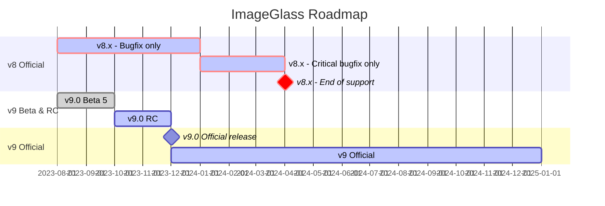

ImageGlass - A lightweight, versatile image viewer
===

ImageGlass is a lightweight software designed for seamless viewing of images in a clean and intuitive interface. With support for over 80 common image formats including `WEBP`, `GIF`, `SVG`, `PNG`, `JXL`, `HEIC`,... ImageGlass also offers advanced features that cater to the needs of both regular users and designers, making it the excellent tool to enhance workflow efficiency.

## 📥 Download

 

  

### ImageGlass on Microsoft Store!
- If you want to support the development of ImageGlass, you can purchase ImageGlass from Microsoft Store.
- Alternatively, you can use the one-time donation from [♥ GitHub Sponsor](https://github.com/sponsors/d2phap), then drop me a message in [ImageGlass Discord](https://discord.com/channels/818852544859209748/818852544859209751) or [email](https://imageglass.org/about), and I will send the code shortly.
- ImageGlass Store provides the convenience of fast, easy installation onto all of your Windows devices along with fully automatic, behind-the-scenes updates with all the newest features, improvements, and fixes.

 

## 🛣 ImageGlass roadmap

### 🔴 ImageGlass 9 minimum requirements:
- [.NET Desktop Runtime 6](https://dotnet.microsoft.com/en-us/download/dotnet/6.0)
- [Webview2 runtime 64-bit](https://developer.microsoft.com/en-us/microsoft-edge/webview2/#download-section)
- Windows 10 version 2004 (20H1) - 64-bit

## 👨‍💻 Development
- Windows 11
- Visual Studio 2022
- .NET Framework 4.8 for v8.x, .NET 6/7 for v9.0

The `develop` branch contains the latest commits of version 9 while the `prod` branch is for the final stable release. For the source code of version 8.0, you can refer to `v8` branch.

## 🗝️ License
ImageGlass is free for both personal and commercial use, except the Store version. If you intend to use ImageGlass at your place of business or for commercial purposes, it's recommended but not enforced to register at https://imageglass.org/license.

## 📚 Docs
- [Features](https://imageglass.org/docs/features)
- [Supported formats](https://imageglass.org/docs/supported-formats)
- [Shortcuts](https://imageglass.org/docs/ui-shortcuts-reference)
- [App configs](https://imageglass.org/docs/app-configs)
- [Command lines](https://imageglass.org/docs/command-line-utilities)
- [EULA](https://imageglass.org/license)

For more information about ImageGlass, go to [ImageGlass Docs](https://imageglass.org/docs).

## 🤼 Community and Support
- [GitHub issues](https://github.com/d2phap/ImageGlass/issues)
- [ImageGlass Discord](https://discord.io/imageglass)
- [Google forum](https://groups.google.com/forum/#!forum/imageglass)

## 💖 This project needs your help!
ImageGlass stands as an open-source, ad-free photo viewer, yet its development and upkeep demand resources. Your financial backing not only sustains this project but also fuels my motivation for crafting future releases.

Should you opt for **GitHub Sponsor** or **Patreon**, be sure to explore the tier-specific benefits on offer.

Your support is greatly appreciated!

