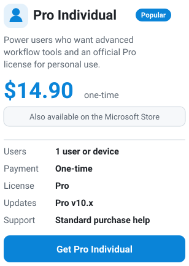
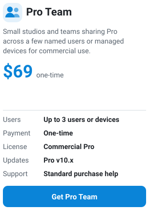
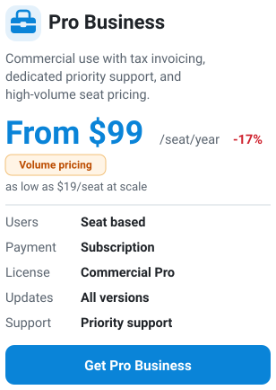
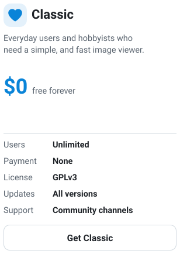

# 🖼️ ImageGlass

### A Fast, Seamless Photo Viewer

ImageGlass is a fast, modern, open-source image viewer built for Windows, macOS, and Linux. Designed for speed and efficiency, it delivers a smooth, immersive viewing experience by combining high-performance rendering with powerful tools for both everyday users and designers. ImageGlass provides seamless, quick navigation across 90+ image formats, including `WEBP`, `JXL`, `SVG`, `HEIC`, `AVIF`, `HDR`, and raw images.

 

 

[**🌐 Website**](https://imageglass.org) &nbsp;•&nbsp;
[**📥 Pricing**](https://imageglass.org/pricing) &nbsp;•&nbsp;
[**📚 Docs**](https://imageglass.org/docs) &nbsp;•&nbsp;
[**💬 Discord**](https://discord.gg/tWjbynH2X8) &nbsp;•&nbsp;
[**💖 Donate**](https://imageglass.org/donate)

 

 

<table>
<tr valign="top">
<td width="25%" align="center"><a target="_blank" href="https://buy.stripe.com/dRmfZh2wJaCSaOB1h7fUQ09?client_reference_id=pro-individual__onetime__imageglass-10-0-6-906-66"><picture>
  <source media="(prefers-color-scheme: dark)" srcset=".github/assets/pricing/pro-individual-dark.svg"/>
  
</picture></a></td>
<td width="25%" align="center"><a target="_blank" href="https://buy.stripe.com/6oU8wP5IVh1g4qdcZPfUQ0a?client_reference_id=pro-team__onetime__imageglass-10-0-6-906-66"><picture>
  <source media="(prefers-color-scheme: dark)" srcset=".github/assets/pricing/pro-team-dark.svg"/>
  
</picture></a></td>
<td width="25%" align="center"><a target="_blank" href="https://buy.stripe.com/14A4gz8V73aq5uhcZPfUQ0b?client_reference_id=pro-business__yearly__imageglass-10-0-6-906-66"><picture>
  <source media="(prefers-color-scheme: dark)" srcset=".github/assets/pricing/pro-business-dark.svg"/>
  
</picture></a></td>
<td width="25%" align="center"><a target="_blank" href="https://imageglass.org/download"><picture>
  <source media="(prefers-color-scheme: dark)" srcset=".github/assets/pricing/classic-dark.svg"/>
  
</picture></a></td>
</tr>
</table>

👉 Compare all plans and features at [imageglass.org/pricing](https://imageglass.org/pricing).

 

> [!Caution]
> ### Security Alert: Fake Repositories and AI Threat Mitigation
> Automated malicious campaigns are actively deploying AI tools to impersonate trusted software. They stand up fake GitHub profiles and Gists designed to trick users into downloading compromised packages.
> - **Only use official channels**: Always download ImageGlass directly from the ([official website](https://imageglass.org)). Never download binaries from third-party mirrors, unverified GitHub forks, or standalone GitHub Gists.
> - **Verify the repo source:** The only authentic spaces for this project on GitHub are the official [d2phap/ImageGlass](https://github.com/d2phap/ImageGlass) repository and the [ImageGlass Organization](https://github.com/ImageGlass). Any other profile or fork promising 'portable patches', 'extended releases', or alternative mirrors is completely unauthorized and highly likely to contain malware.
> - **Check the URL**: Double-check your browser address bar to ensure you are not visiting a typosquatted domain.

 

## Features
Primarily a photo viewer, ImageGlass offers a wide array of features geared toward image viewing, along with some focused editing capabilities. Here are some of the key features:
- Supports [90+ image formats](https://imageglass.org/docs/supported-formats) out of the box
- Hardware-aware smart caching
- Super-fast image browsing with Turbo mode
- Slideshow with random interval and sound notification
- Native SVG and SVGZ vector rendering
- Animated GIF, WEBP, and SVG playback
- Color management and basic HDR support
- Different cursor-precise zoom modes with flexible image interpolations
- Different window modes: Frameless, Window Fit, Full screen
- Built-in Tools: Rotate, Flip, Crop, Resize, Color Picker, Frame Navigation, Lossless compression...
- EXIF metadata viewing through the [ExifGlass tool](https://github.com/d2phap/ExifGlass)
- Touch gestures for zoom and pan
- Themes, layouts, and custom hotkeys
- Custom action binding for toolbar, mouse...
- [Plugins](https://imageglass.org/plugins) and [external tools](https://imageglass.org/tools) support via [ImageGlass.SDK](https://github.com/ImageGlass/SDK)
- Windows: Explorer sort order support
- Windows: Custom file type icon pack (Not available for Store release)

👉 Visit https://imageglass.org/docs/features to explore all features of ImageGlass.

 

## System Requirements
**Version 10**
- Windows 10/11 x64 or arm64, version 1809 (build 17763) or later
- macOS 14+, Apple Silicon arm64
- Linux Desktop X11 x64

**Version 9**
- Windows 10/11 x64 or arm64, version 1809 (build 17763) or later
- Optional: [WebView2 Runtime 64-bit v119.0.2151 or later](https://go.microsoft.com/fwlink/p/?LinkId=2124703)

 

## Development
The `develop` branch contains the latest commits, while the `prod` branch holds the final stable release.

**Version 10**: Located in `source` folder
- Visual Studio 2026 for Windows build
- VS Code for macOS, Linux build
- Run a task from VS Code to build, publish, or pack the app
  + Note: for debug builds, copy the contents of `source/__assets/__app/` into the build output folder, beside the ImageGlass executable, before launching it.

**Version 9**: Located in `v9` folder
- Visual Studio 2026 on Windows 11
- VS Code for `WebUI`

 

## Roadmap

 

## This project needs your help!

If you find ImageGlass useful and would like to support its ongoing development, please consider making a donation or purchase Pro edition. Your support — whether financial or simply sharing ImageGlass with others — means the world to me. Every bit helps keep the project alive for everyone.

#### 👉 Explore the ways to support at [imageglass.org/donate](https://imageglass.org/donate).

